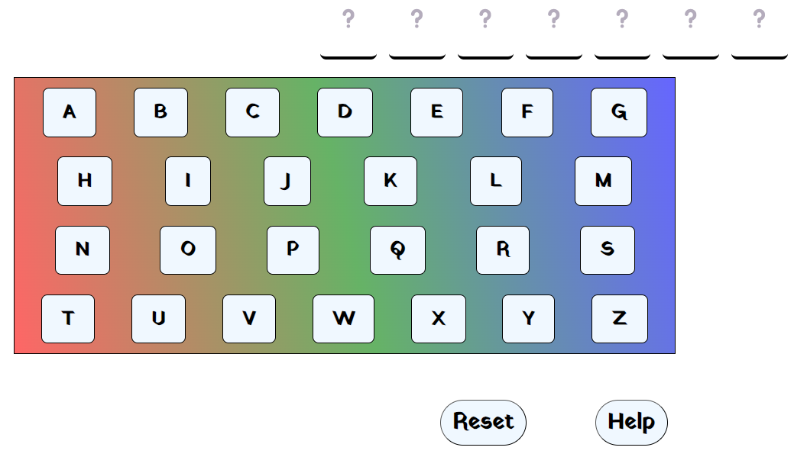

# Hangman Game in React

**Table of Contents**

- [Author](#author)
- [Introduction](#introduction)
- [Heroku Deployment](#heroku)
- [Installation](#installation)
- [Starting the Game](#start)
- [The Rules of Hangman](#rules)

## Author

<a href="https://github.com/HenriBranken" target="_blank">Henri Branken</a>

## Introduction

This project was bootstrapped with [Create React App](https://github.com/facebook/create-react-app): `npx create-react-app`.

Furthermore, this project showcases the creation of React JSX components and Frontend Manipulation to create a game application.

## Heroku Deployment

The app may be found at the following site: [https://henri-hangman-b72d85b0311a.herokuapp.com/](https://henri-hangman-b72d85b0311a.herokuapp.com/)

## Installation

- Navigate to the repo directory.
- From the command-line, execute `npm install`. This will create a `node_modules` folder containing all package dependencies.

## Starting the Game

After successful installation, execute the following from the command-line: `npm start`.
This will run the app in development mode. Open [http://localhost:3000](http://localhost:3000) to view the app in your favourite browser.

As a side-note, it would be best to view the app in Full-Screen Mode by pressing **`F11`**.

## The Rules of Hangman

- The computer has chosen a random, mystery word from the dictionary, and it is your job to guess what that word is.
- You are provided with an on-screen keyboard, and you may test out if the mystery word contains your selected letters.
- Once a letter has been selected, it cannot be re-selected again.
- The challenge is that you're only allowed a maximum of 9 mistakes with regards to picking a letter.
- If you have not finished the mystery word, and make your 10th mistake, then it is game over for you, and the complete "Hangman Picture" will be shown.
- However, if you've successfully found all letters belonging to the mystery word before making your 10th mistake, then you have won the game.
- As more characters get revealed in the mystery word, try to deduce what the entire word is in an attempt to not lose the game.
- Once you have won or lost the game, click the "Okay" button to start a fresh new round of Hangman.
- If you have lost, the entire word will be revealed to you at the end.

At any point during the game, you are welcome to click the "Reset" button to generate a new, different word, and therefore a brand new round of Hangman.

Enjoy, and have fun.
